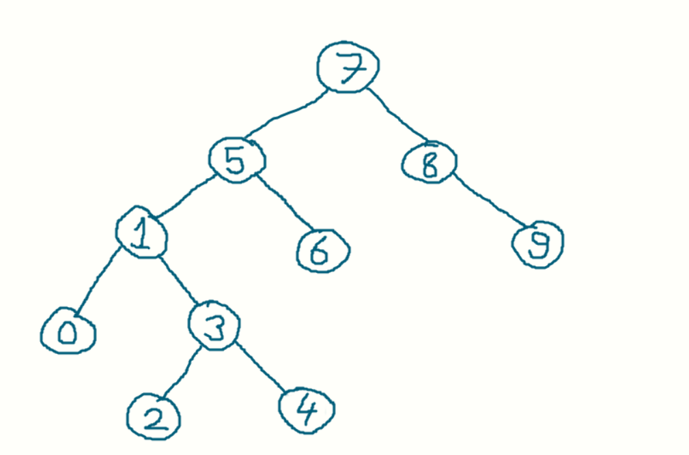

# Project 3

Root 7'dir, 5 solunda bulunur.

1 5'ten küçüktür 5'in solunda bulunur.

8, root'tan büyüktür, root'un sağında bulunur.

3 root'tan küçüktür, soluna bakılır, solunda 5 var, 5'ten de küçüktür 5'in soluna bakılır, 1 var, 1'in sağına eklenir.

6 root'tan küçüktür, soluna bakılır, solunda 5 var, 5'ten büyüktür, 5'in sağına eklenir.

0 root'tan küçüktür, soluna bakılır, solunda 5 var, 5'ten de küçüktür 5'in soluna bakılır 1 var, 1'in soluna eklenir.

9 root'tan büyüktür, sağına bakılır 8 görünür ve 8'in sağına eklenir.

4 root'tan küçüktür, soluna bakılır, solunda 5 var, 5'ten de küçüktür, 5'in soluna bakılır 1 var, 1'in sağına bakılır 3 var, 3'ün sağına eklenir.

2 root'tan küçüktür, soluna bakılır, solunda 5 var, 5'ten de küçüktür, 5'in soluna bakılır 1 var, 1'in sağına bakılır 3 var, 3'ün soluna eklenir. 

[Patika.dev](https://app.patika.dev)